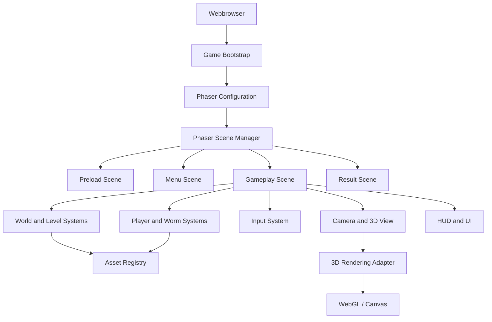

# Architekturübersicht

## Produkt

Killerworms ist ein 3D-Webbrowsergame. Das Spiel läuft clientseitig im Browser und verwendet Phaser als Spiel-Framework. Die Architektur soll schnelle Iteration, klare Trennung der Spielsysteme und eine stabile Ausführung auf aktuellen Desktop-Browsern ermöglichen.

## Technologischer Rahmen

- **Plattform:** moderner Webbrowser
- **Framework:** Phaser 3
- **Sprache:** TypeScript
- **Rendering:** WebGL als bevorzugter Renderer, Canvas als Fallback
- **Build:** ein moderner JavaScript/TypeScript-Bundler mit Development-Server und Production-Build
- **Assets:** versionierte Modelle, Texturen, Animationen, Audio-Dateien und Leveldaten

Phaser übernimmt die Spielschleife, Szenenverwaltung, Eingabe, Zeitsteuerung, Audio-Anbindung und 2D-nahe Spielsysteme. Die 3D-Darstellung wird hinter einer eigenen Rendering-Abstraktion gekapselt, damit Spielcode nicht direkt von konkreten Rendering-Details abhängt.

## Systemübersicht



## Schichten

### 1. Bootstrap und Konfiguration

Der Bootstrap erstellt die Phaser-Konfiguration, registriert gemeinsame Plugins und startet die erste Szene. Plattformabhängige Einstellungen wie Renderer, Skalierung, Debug-Modus und Audio-Unterstützung werden zentral konfiguriert.

### 2. Szenen

Szenen besitzen einen klaren Lebenszyklus und koordinieren nur die Systeme, die zu ihrem Zustand gehören:

- **PreloadScene:** lädt Assets, zeigt Ladefortschritt und behandelt Ladefehler.
- **MenuScene:** Start, Einstellungen und gegebenenfalls Auswahl von Spielmodi.
- **GameplayScene:** initialisiert und aktualisiert die aktive Spielwelt.
- **ResultScene:** zeigt Ergebnis, Neustart und Rückkehr zum Menü.

Szenen sollen keine globale Spiellogik duplizieren. Persistenter Zustand wird über klar definierte Services oder einen Game-State gehalten.

### 3. Gameplay-Systeme

Die Gameplay-Szene verwendet voneinander getrennte Systeme mit kleinen, gut testbaren Verantwortlichkeiten:

- **InputSystem:** normalisiert Maus- und Touch-Eingaben in ein gemeinsames Bewegungsziel.
- **PlayerSystem:** Bewegung, Fähigkeiten, Schaden, Leben und Respawn des Spielers.
- **WormSystem:** Erzeugung, Segmentverwaltung, Wachstum, Kollisionen und Lebenszyklus der Würmer.
- **WorldSystem:** Leveldaten, Hindernisse, Sammelobjekte und Weltgrenzen.
- **CollisionSystem:** kapselt Kollisionsregeln und meldet Gameplay-Ereignisse.
- **ScoreSystem:** Punkte, Fortschritt und relevante Spielstatistiken.
- **AudioSystem:** Musik, Effekte, Lautstärke und Browser-Autoplay-Regeln.
- **UISystem:** HUD, Statusanzeigen, Pause und Fehlermeldungen.

Systeme kommunizieren vorzugsweise über Daten und Ereignisse statt über direkte Querabhängigkeiten.

## Zentrale Spielmechanik

Das Spiel folgt dem Worms-Prinzip: Der Spieler steuert einen Wurm, der aus einem Kopf und einer geordneten Folge von Segmenten besteht. Characters sind fressbare Ziele in der Spielwelt. Wird ein Character vom Wurm gefressen, wächst der Wurm dauerhaft um eine definierte Anzahl von Segmenten.

### Wurm und Wachstum

- Der Wurm besitzt mindestens `headPosition`, `segments`, `direction`, `speed` und `length`.
- Die Segmentpositionen folgen der zuvor vom Kopf durchlaufenen Route. Dadurch bleibt die Bewegung auch bei variabler Framerate stabil.
- Ein gültiger Fresskontakt erzeugt genau ein `CharacterEaten`-Ereignis.
- Das `WormSystem` verarbeitet das Ereignis, erhöht Länge und Score und fügt die neuen Segmente am Schwanz hinzu.
- Ein bereits gefressener Character wird sofort deaktiviert, damit er nicht mehrfach gezählt wird.
- Wachstum verändert die Kollisionsfläche und die sichtbare 3D-Geometrie synchron.
- Kollisionen mit dem Spielfeldrand, Hindernissen oder dem eigenen Körper werden als eigene Regeln behandelt und dürfen das Wachstum nicht stillschweigend rückgängig machen.

### Maus- und Touch-Steuerung

Maus und Touch steuern beide dasselbe Bewegungsziel. Die Eingabe wird relativ zur Spielfläche in Weltkoordinaten umgerechnet und an das `WormSystem` übergeben.

- **Maus:** Pointer-Bewegung oder Klick-/Drag-Ziel bestimmen die gewünschte Richtung.
- **Touch:** Ein Finger-Drag oder virtuelles Ziel auf der Spielfläche bestimmt die gewünschte Richtung.
- Pointer- und Touch-Ereignisse werden über Phaser vereinheitlicht; die Gameplay-Systeme kennen keine DOM-Eventtypen.
- Kurze Eingaben dürfen nicht zum unbeabsichtigten Scrollen oder Zoomen der Spielfläche führen.
- Bei fehlendem aktiven Pointer-Ziel hält der Wurm seine letzte gültige Richtung.
- Die Steuerung muss auf Desktop und mobilen Viewports mit responsiver Spielfläche funktionieren.

Die Input-Daten enthalten mindestens `position`, `direction`, `isActive` und einen Zeitstempel. Das `InputSystem` begrenzt extreme Richtungsänderungen, damit der Wurm nicht in einem einzigen Frame unkontrolliert umkehrt.

### 4. 3D-Rendering

Die 3D-Welt wird über eine `Renderer3D`-Abstraktion eingebunden. Diese Abstraktion verwaltet Kamera, Szenenobjekte, Modelle, Materialien, Beleuchtung und die Synchronisierung mit Phaser-Objekten. Gameplay-Systeme arbeiten mit Weltkoordinaten und Domänenzuständen, nicht mit rohen Renderer-Objekten.

Für die erste Version gilt:

- Renderer-Initialisierung und Größenanpassung sind zentral.
- Kamerabewegung und Spielerposition müssen deterministisch synchronisiert werden.
- Teure Effekte bleiben optional und müssen auf schwächeren Geräten abschaltbar sein.
- Asset-Laden erfolgt über einen zentralen Asset-Katalog.
- Nicht sichtbare oder weit entfernte Objekte werden vereinfacht oder nicht aktualisiert.

## Spielschleife

Die Gameplay-Szene verarbeitet jeden Frame in dieser Reihenfolge:

1. Maus- und Touch-Eingaben lesen und in ein Bewegungsziel umwandeln.
2. Kopfposition und Segmentroute des Spielwurms aktualisieren.
3. Characters, Hindernisse, Spielfeldgrenzen und Körpersegmente auf Kollisionen prüfen.
4. `CharacterEaten`-Ereignisse verarbeiten und den Wurm wachsen lassen.
5. Spielereignisse wie Schaden, Sammeln, Wachstum oder Sieg verteilen.
6. Kamera und 3D-Objekte mit dem neuen Zustand synchronisieren.
7. HUD und Audio anhand relevanter Änderungen aktualisieren.
8. Phaser rendert den aktuellen Frame.

Zeitabhängige Bewegungen verwenden die von Phaser gelieferte Delta-Zeit. Die Spiellogik darf nicht von einer festen Framerate ausgehen.

## Zustandsmodell

Der globale Spielzustand wird auf wenige explizite Zustände begrenzt:

- `booting`
- `loading`
- `menu`
- `playing`
- `paused`
- `result`
- `error`

Zustandswechsel werden über benannte Aktionen oder Ereignisse ausgelöst. Direkte Änderungen an mehreren Szenen oder UI-Komponenten sind zu vermeiden.

## Empfohlene Projektstruktur

```text
src/
  main.ts
  game/
    config.ts
    scenes/
      PreloadScene.ts
      MenuScene.ts
      GameplayScene.ts
      ResultScene.ts
    systems/
      InputSystem.ts
      PlayerSystem.ts
      WormSystem.ts
      WorldSystem.ts
      CollisionSystem.ts
      ScoreSystem.ts
      AudioSystem.ts
      UISystem.ts
    rendering/
      Renderer3D.ts
      CameraController.ts
    state/
      GameState.ts
    assets/
      assetManifest.ts
  ui/
  types/
spec/
  architecture.md
```

Die Struktur ist eine Zielstruktur. Neue Module sollen nach ihrer fachlichen Verantwortung einsortiert werden; allgemeine Utility-Dateien dürfen nicht als Ablage für unklare Spiel- oder Renderinglogik dienen.

## Daten- und Asset-Fluss

1. `PreloadScene` liest den Asset-Katalog.
2. Phaser lädt und validiert die benötigten Dateien.
3. Der Asset-Registry stellt geladene Assets den Systemen über stabile Schlüssel bereit.
4. Leveldaten erzeugen Weltobjekte und verknüpfen sie mit Renderer-Objekten.
5. Gameplay-Zustände ändern sich ausschließlich über System-APIs oder definierte Ereignisse.

Ladefehler werden sichtbar behandelt. Ein fehlendes Pflicht-Asset darf nicht stillschweigend zu einem unvollständigen Gameplay-Zustand führen.

## Nichtfunktionale Anforderungen

- Der initiale Start soll einen sichtbaren Ladezustand anzeigen.
- Die Spiellogik bleibt unabhängig von einer einzelnen Bildschirmauflösung.
- Fenstergröße und Ausrichtung werden responsiv behandelt.
- Pausieren stoppt zeitabhängige Gameplay-Updates und berücksichtigt den Fokusverlust des Browsers.
- Debug-Overlays und ausführliche Logs sind nur im Entwicklungsmodus aktiv.
- Tastaturbedienung und grundlegende UI-Fokussierung werden von Beginn an berücksichtigt.
- Die Produktion verwendet einen optimierten, reproduzierbaren Build.

## Teststrategie

- **Unit-Tests:** Zustandsübergänge, Punkteberechnung, Bewegungsregeln, Segmentwachstum und Kollisionsregeln.
- **Integrations-Tests:** Szenenwechsel, Asset-Laden, Fressen eines Characters und Zusammenspiel der Gameplay-Systeme.
- **Browser-Tests:** Start des Spiels, Resize, Maussteuerung, Touch-Drag, Pause/Resume und ein kompletter kurzer Gameplay-Durchlauf.
- **Manuelle Prüfung:** WebGL/Canvas-Fallback, Audio-Freigabe, Fressanimation, sichtbares Wurmwachstum und Leistung auf unterschiedlichen Bildschirmgrößen.

## Offene Architekturentscheidungen

- Welche 3D-Renderinglösung konkret hinter `Renderer3D` eingesetzt wird.
- Ob Leveldaten statisch gebündelt oder zur Laufzeit geladen werden.
- Ob ein Multiplayer- oder Backend-Anteil benötigt wird.
- Welche Browser und mobilen Geräte offiziell unterstützt werden.
- Welche Physikbibliothek erforderlich ist, falls Phaser-Kollisionen für die Spielmechanik nicht ausreichen.
